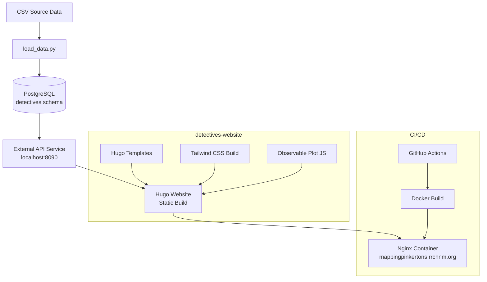
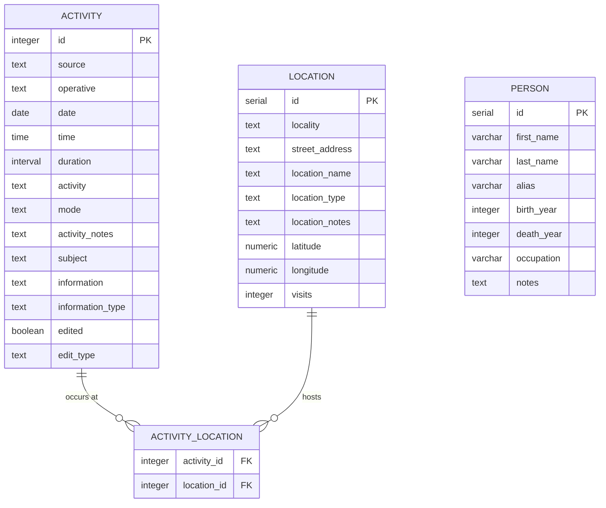

# AGENTS.md

> For feature specifications, business rules, and domain models, see [SPEC.md](./SPEC.md).

---

## Table of Contents

- [Project Overview](#project-overview)
- [Tech Stack](#tech-stack)
  - [Package Management](#package-management)
  - [Backend](#backend)
  - [Frontend](#frontend)
  - [Database](#database)
- [Project Initialization](#project-initialization)
- [Project Structure](#project-structure)
- [Architecture](#architecture)
  - [System Architecture Diagram](#system-architecture-diagram)
  - [Database Diagram](#database-diagram)
- [Development Workflow](#development-workflow)
  - [Version Control](#version-control)
  - [Database Migrations](#database-migrations)
  - [Debugging & Logging](#debugging--logging)
  - [Serving the Application](#serving-the-application)
  - [Testing Approach](#testing-approach)
- [Best Practices & Key Conventions](#best-practices--key-conventions)
- [Notes for AI Agents](#notes-for-ai-agents)

---

## Project Overview

**Mapping the Pinkertons** is a digital history project by the Roy Rosenzweig Center for History and New Media (RRCHNM) that maps Pinkerton Detective Agency surveillance activities in El Paso, Texas and surrounding regions during the late 1930s labor disputes.

The project digitizes and structures historical records of surveillance — who was watching, who was watched, when, where, and what was observed — and presents them as an interactive public-facing website. Target audiences are historians, researchers, and the general public interested in labor history, surveillance history, and Southwest regional history.

The system has three components:
1. **PostgreSQL database** (`detectives` schema) storing activities, locations, and people
2. **Python data pipeline** for loading and geocoding CSV source data
3. **Hugo static website** with an interactive map, activities browser, and Observable Plot visualizations

---

## Tech Stack

| Layer | Technology |
|---|---|
| Database | PostgreSQL 12+ with `detectives` schema |
| Migrations | golang-migrate |
| Data pipeline | Python 3.13+, uv, psycopg2 |
| Static site | Hugo 0.107.0+ |
| CSS | Tailwind CSS v3 + @tailwindcss/typography |
| Visualizations | Observable Plot 0.6 (CDN ESM) |
| Node tooling | npm (in `themes/pinkertons/`) |
| CI/CD | GitHub Actions → Docker → Nginx |

### Package Management

**Python**: Use `uv` exclusively — not pip, not poetry.
- Python version: 3.13+ (specified in `.python-version`)
- Dependencies declared in `utils/pyproject.toml`
- Scripts use PEP 723 inline dependencies with `#!/usr/bin/env uv run` shebang, so they can run standalone without a venv

**Node (website only)**: npm, scoped to `detectives-website/themes/pinkertons/`
- `package.json` in the theme directory manages Tailwind and postcss
- `node_modules/` lives in `themes/pinkertons/`, not the repo root or `detectives-website/`

### Backend

The "backend" is a Python data loading pipeline — there is no application server. Key scripts:

- `utils/load_data.py` — CSV → PostgreSQL import. Parses dates/times/durations, deduplicates locations, upserts activities via `ON CONFLICT`.
- `utils/geocoder.py` — OpenStreetMap Nominatim geocoding. Disabled by default; enabled with `--geocode` flag. Respects 1 req/sec rate limit. Uses `@lru_cache`.

The Hugo website fetches data from an external API (at `localhost:8090` in development) for the interactive map and visualizations. That API service is not part of this repository.

### Frontend

- **Static site generator**: Hugo with custom theme `pinkertons`
- **CSS**: Tailwind CSS v3 utility classes using the `grit` custom color palette
- **Typography**: Oswald (`font-heading`) + EB Garamond (`font-body`) via Google Fonts
- **Visualizations**: Observable Plot 0.6 loaded via CDN ESM import — no build step
- **Footnotes**: `littlefoot.js` loaded from unpkg CDN

All theme files live in `detectives-website/themes/pinkertons/`. Do not edit `detectives-website/layouts/` — it doesn't exist; the theme owns all layouts.

### Database

- **Database**: PostgreSQL 12+
- **Schema**: `detectives` (all tables are prefixed `detectives.tablename`)
- **Migrations**: golang-migrate with custom tracking table `detectives_schema_migrations` (allows coexistence with other projects in a shared database like `apiary`)
- **Adapter**: psycopg2-binary (Python)
- **No ORM**: Raw SQL via psycopg2 cursor

---

## Project Initialization

**Prerequisites**: PostgreSQL 12+, golang-migrate, uv, Hugo 0.107.0+, Node.js 16+

```bash
# 1. Copy environment config
cp .env.example .env
# Edit .env with your database credentials

# 2. Create database
make db-create

# 3. Run migrations
make migrate-up

# 4. Install Python dependencies
cd utils && uv sync && cd ..

# 5. Load data
uv run utils/load_data.py data/el_paso.csv --crosswalk data/crosswalk.csv

# 6. Install website Node deps (for Tailwind)
cd detectives-website/themes/pinkertons && npm install && cd ../../..

# 7. Build Tailwind CSS
cd detectives-website && make tailwind && cd ..

# 8. Serve the website
cd detectives-website && make serve
# Visit http://localhost:1313
```

---

## Project Structure

```
.
├── db/migrations/               # golang-migrate SQL files (up/down pairs)
├── data/                        # CSV source data
│   ├── el_paso.csv              # Primary activity data
│   └── crosswalk.csv            # Pre-geocoded coordinates and visit counts
├── utils/                       # Python data pipeline
│   ├── load_data.py             # Main CSV import script
│   ├── geocoder.py              # OSM Nominatim geocoding
│   └── pyproject.toml           # Python dependencies (uv)
├── detectives-website/          # Hugo static site
│   ├── content/                 # Markdown content pages
│   │   └── visualizations/      # One .md per visualization
│   ├── themes/pinkertons/       # All theme files (layouts, CSS, JS)
│   │   ├── layouts/             # Hugo HTML templates
│   │   ├── assets/css/          # Tailwind input (main.css) and output (style.css)
│   │   ├── static/js/visualizations/  # Observable Plot JS modules
│   │   ├── tailwind.config.js   # Tailwind + grit color palette
│   │   └── package.json         # npm deps (Tailwind, postcss)
│   ├── config.yaml              # Hugo site configuration
│   ├── Makefile                 # Website build commands
│   └── Dockerfile               # Multi-stage Hugo → Nginx build
├── .github/workflows/           # CI/CD (GitHub Actions)
├── Makefile                     # Database commands (loads .env)
├── justfile                     # Same targets as Makefile for `just` users
└── .env.example                 # Environment variable template
```

---

## Architecture

### System Architecture Diagram



Data flows one direction: CSV → Python pipeline → PostgreSQL → API → Hugo website. The Hugo site is fully static — no server-side rendering at request time.

### Database Diagram



**Notes on schema:**
- `ACTIVITY.id` comes from the source CSV (not auto-generated); it must be unique
- `ACTIVITY.activity` was renamed from `roping` (migration 5) — it stores activity type text like "Surveillance", "Shadowing", not a boolean
- `LOCATION` has a unique constraint on `(locality, street_address, location_name)` — nulls are allowed in any field, matched using `IS NOT DISTINCT FROM`
- `PERSON` table exists but has no FK to `ACTIVITY` yet — subjects are stored as free text in `activities.subject`
- `latitude` is `NUMERIC(10,8)`, `longitude` is `NUMERIC(11,8)`
- All queries must use the `detectives.` schema prefix

**Indexes**: `activities(date, operative, subject, mode, activity)`, `locations(locality, location_type, latitude+longitude partial)`

---

## Development Workflow

### Version Control

- Main branch: `main`
- Commit style: Conventional Commits (`feat:`, `fix:`, `chore:`, `docs:`, `refactor:`)
- Scope examples: `feat(web):`, `fix(db):`, `feat(data):`, `chore(ci):`
- Do not commit: `.env`, `public/`, `logs/`, `node_modules/`, `.venv/`, `hugo_stats.json`

### Database Migrations

Migrations use golang-migrate with `up`/`down` SQL file pairs. The custom tracking table `detectives_schema_migrations` isolates this project if sharing a database.

```bash
# Create new migration pair manually
touch db/migrations/000006_description.up.sql
touch db/migrations/000006_description.down.sql

# Apply migrations
make migrate-up

# Check current version
make migrate-version

# Rollback one step
make migrate-down

# Fix dirty migration state after a failed run
migrate -path db/migrations \
  -database "$(grep DB_URL Makefile | ...)" \
  force <last_good_version>
```

**Rules:**
- Migrations create schema structure only — never INSERT data in migrations
- Always write a corresponding `.down.sql` that fully reverses the `.up.sql`
- If a migration fails mid-way (dirty state), use `migrate force <version>` to reset to the last good version

### Debugging & Logging

**Python pipeline**: All import runs write timestamped logs to `logs/import_YYYYMMDD_HHMMSS.log` using Python's `logging` module. Both file and console output. Check logs for warnings about rows that failed to parse.

```bash
# Watch log output during import
tail -f logs/import_$(ls -t logs/ | head -1)
```

**Hugo website**: Use browser DevTools console to debug visualization JS. Check Network tab to verify the API endpoint and JS module files load. The API endpoint for visualizations is `localhost:8090` in development.

```bash
# Verbose Hugo build
cd detectives-website && hugo serve -D --verbose
```

### Serving the Application

**Development (website)**:
```bash
cd detectives-website
make tailwind      # Build CSS first (required)
make serve         # Hugo dev server at http://localhost:1313 with live reload
```

**Production builds**:
```bash
cd detectives-website
make build         # Development build, baseURL https://mappingpinkertons.rrchnm.org/
make build-prod    # Minified production build, same baseURL
```

**Deployment**: Push to `main` with changes in `detectives-website/**` triggers GitHub Actions. The workflow builds a Docker image (Hugo build stage → Nginx runtime) and deploys to `mappingpinkertons.rrchnm.org`.

### Testing Approach

No automated test suite currently exists. Manual testing:

**Data pipeline**:
```bash
# Test against isolated database
createdb detectives_test
DB_NAME=detectives_test make migrate-up
DB_NAME=detectives_test uv run utils/load_data.py data/el_paso.csv
psql detectives_test -c "SELECT COUNT(*) FROM detectives.activities;"
dropdb detectives_test
```

**Website**: Start `make serve`, verify pages render and visualizations load without console errors.

---

## Best Practices & Key Conventions

### Python

- Use `uv run` — never activate a venv manually or use `pip install`
- Type hints on all function signatures
- Log at appropriate levels; never use bare `print()` in pipeline scripts
- Convert empty strings to `None` before database insertion
- Batch database commits every 100 rows
- Use `@lru_cache` for repeated geocoding lookups
- Linting: Ruff (pre-commit hook in `utils/.pre-commit-config.yaml`)

### SQL

- Always qualify table names: `detectives.activities`, not just `activities`
- Use `ON CONFLICT DO NOTHING` (or `DO UPDATE`) for idempotent loads
- Use `IS NOT DISTINCT FROM` when comparing nullable columns for equality
- Add indexes for columns used in WHERE/JOIN/ORDER BY
- Document columns with `COMMENT ON COLUMN`

### Hugo / HTML

- All layout edits go in `themes/pinkertons/layouts/` — nowhere else
- Use Tailwind utility classes only; no custom CSS rules
- Follow the `grit` color palette (defined in `tailwind.config.js`):
  - Background light: `bg-grit-bg-light` (`#f5f2e8`)
  - Background dark: `bg-grit-bg` (`#1c1f22`)
  - Accent (crimson): `text-grit-accent` / `bg-grit-accent` (`#9c1b1b`)
  - Steel: `text-grit-steel` (`#44697d`)
  - Gold: `text-grit-gold` (`#d0a85c`)
- Headings: `font-heading` (Oswald), body: `font-body` (EB Garamond)
- Run `make tailwind` after adding new Tailwind classes; Hugo's `writeStats: true` feeds class discovery

### Visualizations

- Each visualization is an ES6 module exporting `createVisualization(data)`
- Filename must exactly match the `vizType` frontmatter field (case-sensitive)
- Use Observable Plot 0.6 CDN import: `import * as Plot from "https://cdn.jsdelivr.net/npm/@observablehq/plot@0.6/+esm"`
- Responsive width: `Math.min(1000, window.innerWidth - 100)`
- Always include `tip: true` for hover tooltips
- Use grit colors: primary `#9c1b1b`, gold `#d0a85c`, steel `#44697d`
- See `detectives-website/ADDING-VISUALIZATIONS.md` for full guide

---

## Notes for AI Agents

**Preferred patterns:**
- Python data transforms: filter → map → insert, log warnings for bad rows, never silently drop data
- SQL: prefer explicit column lists over `SELECT *` in application code
- Hugo: check if a partial already exists before creating a new one

**Known gotchas:**
- The `activity` column was formerly `roping` (a boolean). Migration 5 renamed and changed its type to TEXT. Do not reintroduce a `roping` column.
- `hugo_stats.json` is generated by Hugo and consumed by Tailwind. Do not delete it. Do not commit it.
- The Tailwind build runs from `themes/pinkertons/` — the `package.json` and `node_modules` are there, not in `detectives-website/` root.
- The `people` table has no FK to `activities` — subjects are stored as free text in `activities.subject`. Do not add a FK without migrating existing subject text data.
- Activity IDs come from source CSV and are not auto-incremented. They must be unique integers present in the source data.
- When modifying the data loader, always preserve idempotency — running the script twice on the same data must not create duplicates.
- The API endpoint serving data to the Hugo visualizations (`localhost:8090`) is an external service not included in this repository. Do not create a new API layer within this repo without discussion.

**What to avoid:**
- Do not use `pip install` — always `uv`
- Do not write INSERT statements in migration files
- Do not edit files in `detectives-website/public/` — it's a build artifact
- Do not add a `baseURL` override to `config.yaml` — it's controlled via Makefile build targets

---

*Last Updated: 2026-02-23*
*This document is maintained for AI agent context and onboarding.*
