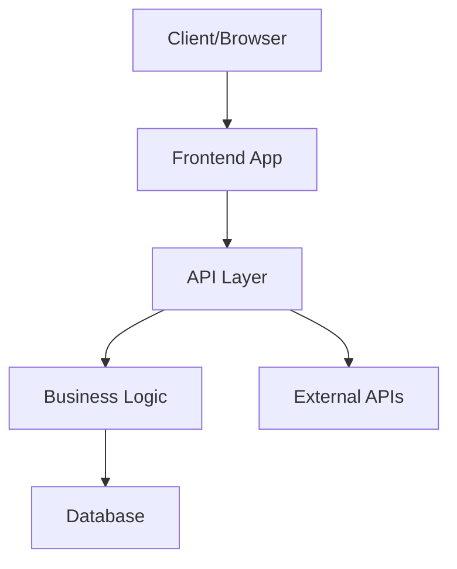
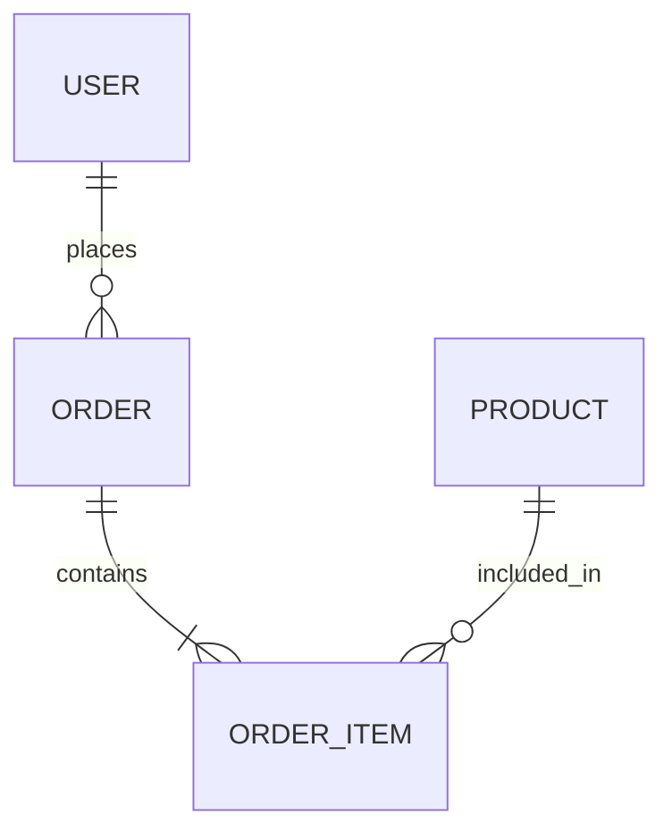

# AGENTS.md

> For feature specifications, business rules, and domain models, see [SPEC.md](./SPEC.md).

---

## Table of Contents

- [Project Overview](#project-overview)
- [Tech Stack](#tech-stack)
  - [Package Management](#package-management)
  - [Backend](#backend)
  - [Frontend](#frontend)
  - [Database](#database)
- [Project Initialization](#project-initialization)
- [Project Structure](#project-structure)
- [Architecture](#architecture)
  - [System Architecture Diagram](#system-architecture-diagram)
  - [Database Diagram](#database-diagram)
  - [REST API Design](#rest-api-design)
- [Authentication & Authorization](#authentication--authorization)
  - [User Auth](#user-auth)
  - [API Auth](#api-auth)
- [Development Workflow](#development-workflow)
  - [Version Control](#version-control)
  - [Database Migrations](#database-migrations)
  - [Debugging & Logging](#debugging--logging)
  - [Serving the Application](#serving-the-application)
  - [Testing Approach](#testing-approach)
- [Best Practices & Key Conventions](#best-practices--key-conventions)
- [Notes for AI Agents](#notes-for-ai-agents)

---

## Project Overview

<!--
Describe the project's purpose, core goals, and key features.
Include:
- What problem does this project solve?
- Who are the target users/audience?
- What are the main features or capabilities?
- What makes this project unique or valuable?
- Any relevant business context or domain information
-->

---

## Tech Stack

<!--
Provide an overview of the technologies and tools used in this project.
Keep this section high-level; details belong in the subsections below.
-->

### Package Management

<!--
Specify package manager and configuration details:
- Which package manager: npm, yarn, pnpm, bun, etc.
- Version requirements (Node.js version, package manager version)
- Important package.json scripts and what they do
- Monorepo setup (if applicable): Turborepo, Nx, Lerna, workspaces
- Lock file policy (committed or not, how to handle conflicts)
-->

### Backend

<!--
Document backend framework and runtime:
- Runtime: Node.js, Deno, Bun, Python, Go, etc.
- Framework: Express, Fastify, NestJS, Django, Flask, Gin, etc.
- Key libraries and their purposes:
  - Validation (Zod, Joi, Yup, etc.)
  - Date handling (date-fns, dayjs, luxon, etc.)
  - File uploads, email, payments, etc.
- API patterns: RESTful, GraphQL, tRPC, gRPC
-->

### Frontend

<!--
Document frontend framework and build tools:
- Framework: React, Vue, Svelte, Angular, etc.
- Build tool: Vite, Webpack, Parcel, Turbopack, etc.
- UI libraries/frameworks: Tailwind CSS, Material-UI, Ant Design, shadcn/ui, etc.
- State management: Redux, Zustand, Jotai, Pinia, etc.
- Routing: React Router, TanStack Router, Next.js App Router, etc.
- Form handling: React Hook Form, Formik, etc.
- Data fetching: TanStack Query, SWR, Apollo Client, etc.
-->

### Database

<!--
Document database and data access details:
- Database type: PostgreSQL, MySQL, MongoDB, SQLite, etc.
- ORM/Query builder: Prisma, Drizzle, TypeORM, Sequelize, Mongoose, etc.
- Connection details: Connection pooling, SSL requirements
- Redis/caching layer (if applicable)
- Full-text search: PostgreSQL FTS, Elasticsearch, Meilisearch, etc.
- Hosting/provider: Supabase, PlanetScale, Railway, AWS RDS, etc.
-->

---

## Project Initialization

<!--
Provide step-by-step setup instructions for new developers:
1. Prerequisites (Node.js version, database installation, etc.)
2. Clone repository command
3. Install dependencies (npm install, etc.)
4. Environment setup:
   - Copy .env.example to .env
   - Required environment variables and how to obtain them
   - API keys, database URLs, secret keys
5. Database setup:
   - Create database
   - Run migrations
   - Seed data (if applicable)
6. First run:
   - Start dev server command
   - Expected output/success indicators
   - Where to access the app (localhost URL)
7. Verify installation:
   - Run tests
   - Check dev tools, linters
8. Common setup issues and solutions
-->

---

## Project Structure

<!--
Document the directory structure and key files/folders:
```
project-root/
├── src/               # Description
│   ├── components/    # Description
│   ├── pages/         # Description
│   ├── api/           # Description
│   ├── lib/           # Description
│   ├── types/         # Description
│   └── utils/         # Description
├── public/            # Description
├── tests/             # Description
├── docs/              # Description
├── .env.example       # Description
├── package.json       # Description
└── README.md          # Description
```

For each major directory/file:
- Purpose and responsibility
- Naming conventions
- When to add new files here
- What doesn't belong here

Explain any non-standard structure choices.
-->

---

## Architecture

<!--
Provide a high-level overview of the system architecture.
Explain how major components interact and data flows through the system.
-->

### System Architecture Diagram

<!--
Include a visual representation of the system architecture.
Use Mermaid diagrams or describe the architecture:



Explain:
- Major system components and their responsibilities
- How data flows between components
- External service integrations
- Deployment architecture (if relevant)
-->

### Database Diagram 

### Database Schema Diagram

<!--
Generate a visual representation of the database schema.

If a database exists, analyze the project files to infer structure.
Sources may include:
- Django models
- ORM models
- SQL schema files
- Migration files (e.g., db/migrations/)
- Schema dumps
- Declarative model definitions

Output a Mermaid ER diagram like:



Rules:
- Only include domain fields (omit framework internals like Django's id defaults, timestamps unless explicitly defined).
- Show primary keys and foreign keys.
- Infer relationships (1–1, 1–many, many–many).
- Use singular entity names.
- Normalize naming if source names are inconsistent.
- If uncertain, make best inference and note assumptions.

After the diagram, explain:

- Each table/model and its purpose
- Relationships between entities
- Key constraints and indexes
- Derived or computed fields (if any)
- Assumptions or inferred structure
- Potential schema concerns or improvements (optional)

If no database is detected, state:
"No database schema detected in project."
-->

### REST API Design

<!--
Document API design patterns and conventions:
- Base URL structure: /api/v1/...
- Resource naming: plural nouns (e.g., /users, /posts)
- HTTP methods and their usage:
  - GET: Retrieve resources
  - POST: Create new resources
  - PUT/PATCH: Update resources
  - DELETE: Remove resources
- Response format standards (JSON structure, metadata, pagination)
- Error response format (status codes, error messages, error codes)
- Versioning strategy
- Common query parameters: ?page=, ?limit=, ?sort=, ?filter=
- Common headers: Authorization, Content-Type, etc.

Example endpoint documentation format:
GET /api/v1/users/:id
- Description: Retrieve a user by ID
- Auth required: Yes
- Response: { "id": 1, "name": "...", ... }
-->

---

## Authentication & Authorization

<!--
Overview of auth strategy and security approach.
-->

### User Auth

<!--
Document user authentication implementation:
- Auth strategy: Session-based, JWT, OAuth, etc.
- Login/signup flow:
  - Registration process
  - Email verification (if applicable)
  - Login endpoint and credential validation
- Session management:
  - Session storage (Redis, database, memory)
  - Session expiration and renewal
  - Logout process
- Password handling:
  - Hashing algorithm (bcrypt, argon2, etc.)
  - Password reset flow
  - Password requirements
- Social auth (if applicable): Google, GitHub, etc.
- Multi-factor authentication (if applicable)
- Frontend auth state management
- Protected routes/pages implementation
-->

### API Auth

<!--
Document API authentication and authorization:
- API authentication method: Bearer tokens, API keys, etc.
- Token generation and validation
- Token refresh mechanism (if applicable)
- Middleware for protecting routes
- Authorization patterns:
  - Role-based access control (RBAC)
  - Permission-based access control
  - Resource ownership validation
- Rate limiting implementation
- CORS configuration
- Security headers: CSP, HSTS, etc.
-->

---

## Development Workflow

<!--
Overview of day-to-day development processes.
-->

### Version Control

<!--
Document Git workflow and branching strategy:
- Branching model: Git Flow, GitHub Flow, trunk-based, etc.
- Branch naming conventions:
  - feature/description
  - bugfix/description
  - hotfix/description
- Commit message format:
  - Conventional Commits (feat:, fix:, docs:, etc.)
  - Required information in messages
- Pull request process:
  - PR template requirements
  - Review requirements (number of approvals)
  - CI checks that must pass
  - Merge strategy (merge commit, squash, rebase)
- Protected branches and policies
- Release process and tagging
-->

### Database Migrations

<!--
Document database migration workflow:
- Migration tool used: Prisma Migrate, Drizzle Kit, TypeORM, etc.
- Creating new migrations:
  - Command to generate migration
  - Naming conventions
  - When to create a new migration
- Applying migrations:
  - Development: npm run migrate:dev
  - Production: npm run migrate:prod
- Migration best practices:
  - Always test rollback
  - Data migration strategies
  - Handling production data safely
- Rollback process
- Seeding data for development/testing
-->

### Debugging & Logging

<!--
Document debugging tools and logging practices:
- Debugger setup:
  - VS Code launch configurations
  - Browser DevTools setup
  - Node.js inspector usage
- Logging library: Winston, Pino, console, etc.
- Log levels and when to use them:
  - error: Errors requiring immediate attention
  - warn: Warning messages
  - info: General informational messages
  - debug: Detailed debugging information
- Log format and structure
- Where logs are stored (files, cloud services, etc.)
- Development debugging tips:
  - Common breakpoint locations
  - Network request inspection
  - State inspection techniques
- Performance profiling tools
-->

### Serving the Application

<!--
Document how to run the application in different environments:

Development:
- Start dev server: npm run dev
- Dev server features: Hot reload, source maps, etc.
- Port numbers and local URLs
- Environment: development mode, .env.development
- Special dev-only features: Debug panels, mock APIs, etc.

Production Build:
- Build command: npm run build
- Build output location
- Build optimization: Minification, code splitting, etc.
- Environment: production mode, .env.production

Production Deployment:
- Hosting platform: Vercel, Netlify, AWS, Railway, etc.
- Deployment command or CI/CD trigger
- Environment variables configuration
- Health check endpoints
- Scaling considerations
- CDN setup (if applicable)
-->

### Testing Approach

<!--
Document testing strategy and tools:
- Testing framework: Jest, Vitest, Mocha, Pytest, etc.
- Test types and coverage:
  - Unit tests: Test individual functions/components
  - Integration tests: Test component interactions
  - E2E tests: Test full user workflows
  - API tests: Test endpoints
- Running tests:
  - All tests: npm test
  - Watch mode: npm test -- --watch
  - Coverage: npm run test:coverage
- Test file organization:
  - Colocated with source files: component.test.ts
  - Separate test directory: tests/
  - Naming conventions
- Mocking strategies:
  - API mocking: MSW, nock, etc.
  - Database mocking
  - External services
- Test coverage requirements (if any)
- CI test execution
- Writing good tests:
  - AAA pattern (Arrange, Act, Assert)
  - Test naming conventions
  - What to test vs. what not to test
-->

---

## Best Practices & Key Conventions

<!--
Document coding standards and conventions:

Code Style:
- Linter: ESLint, Ruff, etc.
- Formatter: Prettier, Black, etc.
- Style guide: Airbnb, Standard, custom, etc.
- Format on save configuration

Naming Conventions:
- Files: camelCase, kebab-case, PascalCase
- Variables: camelCase, UPPER_CASE for constants
- Functions: camelCase, descriptive verb phrases
- Components: PascalCase
- Classes: PascalCase
- Types/Interfaces: PascalCase, I prefix or not

File Organization:
- One component per file
- Colocate related files
- Index file exports
- Barrel exports pattern (or not)

Code Patterns:
- Prefer composition over inheritance
- Keep functions small and focused
- DRY principle application
- When to extract utilities/helpers
- Error handling patterns
- Async/await vs. promises

Component Patterns (if applicable):
- Functional vs. class components
- Custom hooks naming and structure
- Props interface patterns
- Children handling
- Compound components

API Patterns:
- Controller/service/repository layers
- Dependency injection approach
- Error handling and validation
- Response formatting

Comments:
- When to add comments
- JSDoc/TSDoc for public APIs
- Avoid obvious comments
- TODO format: TODO(author): description

Dependencies:
- When to add new dependencies
- Prefer well-maintained libraries
- License compatibility
- Bundle size considerations

Security:
- Input validation
- SQL injection prevention
- XSS prevention
- CSRF protection
- Sensitive data handling

Performance:
- Lazy loading strategies
- Caching approaches
- Database query optimization
- Image optimization
-->

---

## Notes for AI Agents

<!--
Instructions and context specifically for AI coding assistants:

Preferred Approaches:
- List preferred libraries/patterns for common tasks
- Coding style preferences not captured in linter
- Project-specific architectural patterns to follow

Important Context:
- Known technical debt to be aware of
- Deprecated patterns still in codebase (avoid replicating)
- Ongoing migrations or refactoring efforts
- Special compatibility requirements

When Making Changes:
- Always run tests after changes
- Update relevant documentation
- Follow existing patterns in similar files
- Prefer refactoring over duplication
- Consider backwards compatibility

What to Avoid:
- Specific antipatterns for this project
- Libraries/approaches that were tried and rejected
- Over-engineering simple features
- Breaking changes without discussion

File Modification Guidelines:
- Always check existing code before creating new files
- Maintain consistent formatting with surrounding code
- Update imports when moving/renaming files
- Keep related changes in focused commits

Testing Requirements:
- Add tests for new features
- Update tests when changing behavior
- Ensure tests pass before considering work complete
- Test edge cases and error conditions

Common Pitfalls:
- Project-specific gotchas
- Common mistakes to avoid
- Tricky parts of the codebase
-->

---
<!-- AI Agent should use to section to keep track when it last updated this file -->
*Last Updated: YYYY-MM-DD*
*This document is maintained for AI agent context and onboarding.*

